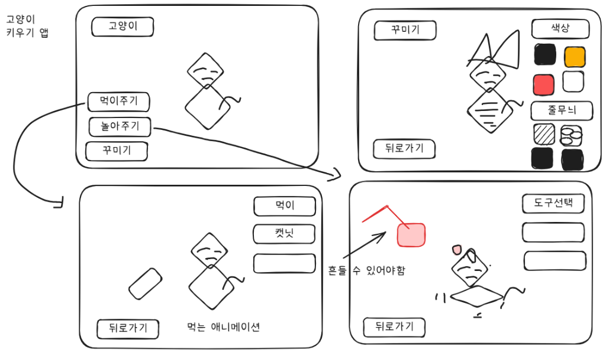

# 🐱 다이아냥 키우기 (Diamond Cat - Virtual Pet App)

기획 스케치 와이어프레임을 바탕으로 제작된 **인터랙티브 기하학적 고양이 키우기 웹 애플리케이션**입니다.  
**Next.js 16 (React 19, Tailwind CSS)** 기반의 모바일 앱 스타일 인터페이스와 **Supabase (Auth & Database)** 실시간 클라우드 동기화를 지원합니다.



---

## ✨ 핵심 기능 및 화면 구성

스케치에 정의된 4가지 핵심 화면을 100% 충실하게 구현하였습니다.

| 화면 | 주요 기능 및 인터랙션 |
| :--- | :--- |
| **🏠 메인 화면 (고양이)** | • 스케치 기반 기하학적 다이아몬드 고양이 벡터(SVG) 캐릭터 렌더링<br>• 터치/클릭 시 골골송(Purr) 사운드 및 하트/골골 파티클 인터랙션<br>• 3대 상태 수치 게이지: **🍗 포만감**, **💖 행복도**, **⭐ 친밀도** 및 레벨<br>• 고양이 이름 수정 및 실시간 저장<br>• 사운드 음소거 토글 및 Supabase 클라우드 동기화 상태 표시 |
| **🍽️ 먹이주기** | • 원클릭 즉시 급여: **사료/캔**, **캣닢**, **참치 츄르**, **신선한 물**<br>• 바닥 그릇에 음식이 채워지고 고양이가 다가가 냠냠 먹는 애니메이션<br>• 캣닢 급여 시 흥분/우다다 파티클과 특수 리액션 연출<br>• 상태 게이지 회복 및 먹는 효과음(Munch, Lick) 재생 |
| **🎣 놀아주기 ("흔들 수 있어야함")** | • **Rope & Spring Physics 물리 엔진** 적용<br>• 마우스/터치 드래그로 장난감을 흔들면 줄과 펜던트가 관성에 따라 탄성 있게 스윙<br>• 고양이 눈동자와 머리가 장난감 위치를 실시간 추적<br>• 빠르게 흔들 때 바람 가르는 소리(Whoosh) 및 덮치기(Pounce) 성공 연출<br>• 4종 장난감: 깃털 낚싯대, 레이저 포인터, 방울 딸랑 쥐, 털실 뭉치 |
| **🎀 꾸미기** | • 선택 즉시 고양이 외형에 반영되는 실시간 프리뷰 시스템<br>• **털 색상**: 치즈, 올블랙, 코랄레드, 순백색, 실버그레이, 버터크림<br>• **무늬 패턴**: 가로 줄무늬(태비), 얼룩/삼색, 턱시도, 솔리드<br>• **장식/악세사리**: 스케치의 귀 리본/꽃, 황금 방울 목걸이, 나비넥타이, 파티모자, 선글라스 |

---

## 🔊 Web Audio API 사운드 신시사이저

외부 MP3 파일 다운로드 없이 브라우저 내장 **Web Audio API**를 활용한 무결점 프로그래밍 사운드를 탑재했습니다:
- 🐱 **야옹 소리 (Meow)**: 주파수 변조 기반 사랑스러운 고양이 울음소리
- 💤 **골골송 (Purr)**: 저주파 진동 모듈레이션의 골골골 사운드
- 🍽️ **냠냠 먹는 소리 (Munch/Lick)**: 아삭아삭 씹는 소리 및 츄르 핥는 소리
- 🎣 **휘두르는 바람 소리 (Whoosh)**: 낚싯대를 빠르게 흔들 때 발생하는 바람 소리
- 🔔 **방울 소리 (Bell Chime)**: 방울 목걸이 및 쥐 장난감 딸랑거림
- 🔴 **레이저 비프음**: 레이저 포인터 작동음
- 🎺 **레벨업 팡파르**: 레벨업 축하 차임 및 폭죽 파티클

---

## ☁️ Supabase 클라우드 데이터베이스 및 인증

- **인증 (Supabase Auth)**:
  - 이메일/비밀번호 기반 회원가입 및 로그인 지원
  - 1초 만에 바로 플레이 가능한 **체험용 계정 원클릭 로그인** 지원
  - 미가입 계정 로그인 시 자동 회원가입 전환 안내
- **데이터베이스 (PostgreSQL `cats` 테이블)**:
  - 포만감, 행복도, 친밀도, 레벨, 색상, 패턴, 악세사리 상태 영구 저장
  - 본인 고양이만 조회/수정 가능한 **Row Level Security (RLS)** 정책 적용
- **오프라인/로컬 모드 지원**:
  - Supabase 키가 없거나 비로그인 상태에서도 LocalStorage를 통해 진행 데이터가 유실 없이 저장됩니다.

---

## 🛠️ 기술 스택

- **Framework**: [Next.js 16 (App Router)](https://nextjs.org/)
- **UI & Styling**: [React 19](https://react.dev/), [Tailwind CSS v4](https://tailwindcss.com/), [Lucide React](https://lucide.dev/)
- **Animation & Physics**: SVG Procedural Rendering, Canvas Confetti, Custom Spring/Pendulum Physics
- **Audio Engine**: Native Web Audio API
- **Backend & DB**: [Supabase](https://supabase.com/) (Auth, PostgreSQL, Row Level Security)
- **Language**: TypeScript

---

## 🚀 시작하기

### 1. 패키지 설치
```bash
npm install
```

### 2. 환경 변수 설정
`.env.example`을 복사하여 `.env.local`을 생성하고 Supabase 프로젝트 키를 설정합니다.
```bash
cp .env.example .env.local
```

```env
NEXT_PUBLIC_SUPABASE_URL=https://your-project-ref.supabase.co
NEXT_PUBLIC_SUPABASE_ANON_KEY=your-anon-key-here
NEXT_PUBLIC_SUPABASE_PUBLISHABLE_KEY=your-publishable-key-here
```

### 3. 데이터베이스 테이블 생성
Supabase 대시보드의 **SQL Editor**에서 [`supabase/schema.sql`](supabase/schema.sql)을 실행합니다.

### 4. 개발 서버 실행
```bash
npm run dev
```

브라우저에서 `http://localhost:3000`에 접속하여 귀여운 다이아냥을 키워보세요!
